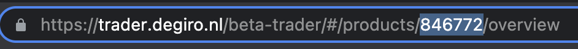

# DeGiro Automation
This repository helps you to easily setup automated asset buying through [DeGiro](https://www.degiro.nl/start-met-beleggen?id=8970B176&utm_source=mgm).
One highly requested feature for the DeGiro is the automated buying of stocks on a recurring basis.
This makes investing money in ETFs a hands of process, which will take the emotion out of it and will probably result in higher yields in the long run.

No coding and no hosting is required to get this script running. This repository makes use of
Github actions to run the code. Setting this up should only take 5 minutes.

## How to use
1. Clone the repository and set up the environment variables `DEGIRO_USER` and `DEGIRO_PWD` (Settings > Secrets and variables > Actions)
2. Set up an automated monthly transaction at your bank based on the amount of money you want to invest. Keep in mind that this transaction can take up to 5 days before the amount is usable in your DeGiro account. So keep this in mind that you set this up x days before the beginning of each month to make sure there is enough money for the automated order to be executed.
3. Configure the product you want to order by setting `PRODUCT_ID` and other Environment variables explained in the table below.
4. Do a test run manual trigger action
5. Forget about this

## Environment variables
I've created this script so that you can configure it without needing to touch a single line of code. This should even make it possible for less technical people to get this script up and running.

| Variable  | Description  |
|---|---|
| `DEGIRO_USER`  | Username to log in to your DEGIRO account  |
| `DEGIRO_PWD` | Password to log in to your DEGIRO account  |
| `PRODUCT_ID` | Product ID of the ETF or stock you want to buy on a monthly basis. [Read more](https://github.com/Sitebase/degiro-automation#product-id)  |
| `MAX_ORDER_VALUE` | The maximum value you want to spend per monthly order. If for example you set this to 200 euro and the stock you choose for `PRODUCT_ID` costs 90 euro this script will buy 2 shares for 180 euro and the rest value will stay in your wallet. Keep in mind that if the stock price rises to 101 this mean we wil only be able to buy one share.  |
| `TRADE` | Without setting this variable to `iaccept` the script will run in debug mode and will not execute the actual order. This can help during the setup to validate if everything is working. Set this value to `iaccept` to actually start executing the orders. |

## Product ID
To get the `PRODUCT_ID` for your prefered stock or ETF you go to [DeGiro](https://www.degiro.nl/start-met-beleggen?id=8970B176&utm_source=mgm) and login. Now search for you prefered stock or ETF in the search bar and click on the stock.
In the address bar of your browser you'll now find a nummeric value which will be the `PRODUCT_ID`. Copy this value and set it in the environment variable.

## Schedule
Currently the script is automatically run each hour of every monday. The reason that I do this is to make sure no matter on what exchange your buy stock it will try until an order is placed.

The script will also verify that there was no order yet this month to ensure even if the script runs multiple times you'll only buy once.

**NOTE** Keep in mind that if you would manually buy the same stock as used in this automated script it will be detected as you already bought for the current month and will not place a new order.

## Suggestions
All suggestions on how we can improve this project are welcome. Feel free to create an issue and let's discuss your ideas.

## Disclaimer
* This repository is based on an unofficial API of DeGiro. This means that this can potentially break in the future resulting in no more orders getting executed.
* I'm not responsible for any flaws in this repository. At the end this code is trading with real money so use it at your own risk.

## Buy me a coffee
Other companies ask a 1% portfolio fee on an annual basis for such an automation.
You can decide yourself what it's worth to you.
